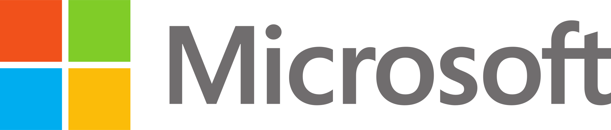
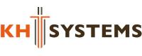
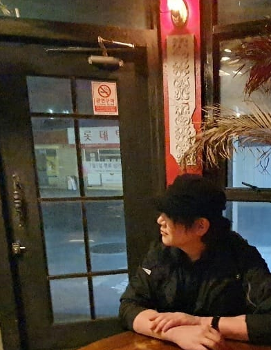
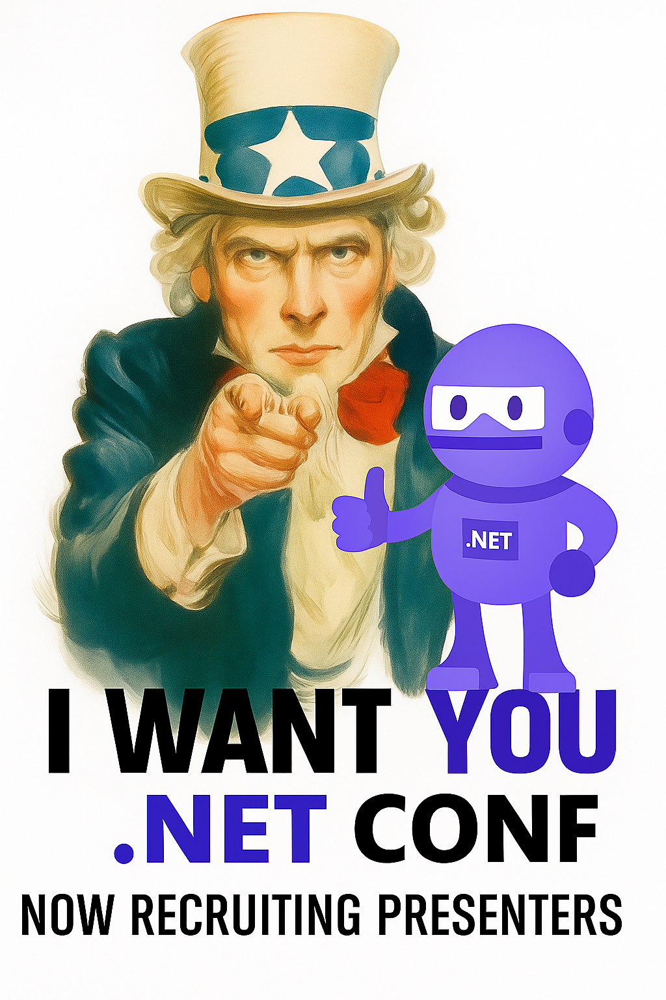

Title: .NET Conf 2025 @Seoul
---

    

전 세계 개발자 컨퍼런스 .NET Conf와 함께하는 한국 로컬 행사입니다.
최신 .NET 기술 소식과 적용 사례를 공유하고,
국내 개발자들의 경험과 인사이트를 나누는 자리입니다.
기술 발표와 네트워킹을 통해 새로운 가능성을 탐색하고,
함께 성장하는 시간을 만나보세요. 🚀

---

## 📅 행사일정
 

- **장소** : [한국마이크로소프트](https://maps.google.com/?cid=8257584141974728477&g_mp=CiVnb29nbGUubWFwcy5wbGFjZXMudjEuUGxhY2VzLkdldFBsYWNl) 13층 | 서울특별시 종로구 종로1길 50 더케이트윈타워
- **일정 :** 11월 27일(목) 10시 ~ 17시(점심식사 제공)
- 주차 지원 안되니 대중 교통 이용 부탁드립니다. 

  <a href="https://www.onoffmix.com/event/331906" target="_blank" 
     class="btn btn-primary btn-lg px-4 py-2 fw-bold">
    ✅ 접수하기
  </a>

    <iframe src="https://www.google.com/maps/embed?pb=!1m18!1m12!1m3!1d1581.0870766812911!2d126.9785586013715!3d37.57451660387266!2m3!1f0!2f0!3f0!3m2!1i1024!2i768!4f13.1!3m3!1m2!1s0x357ca413fe38a245%3A0x7298d506cd4d6f1d!2z7ZWc6rWt66eI7J207YGs66Gc7IaM7ZSE7Yq4!5e0!3m2!1sko!2skr!4v1761207959163!5m2!1sko!2skr" width="600" height="450" style="border:0;" allowfullscreen="" loading="lazy" referrerpolicy="no-referrer-when-downgrade">
</iframe>

---

## 🤝 후원사
 

**.NET Conf 2025 @Seoul** 은 다음과 같은 후원사들의 지원으로 진행됩니다:
 

  <a href="https://forms.office.com/r/3cMZLnaq1X" target="_blank" class="btn btn-primary btn-lg px-5 py-3 fw-bold">
    후원사 신청하기
  </a>

 

 

  <a href="https://www.microsoft.com/ko-kr/" target="_blank" class="text-decoration-none">
    

      
      
      
      <h5 class="fw-bold text-dark mt-auto">마이크로소프트</h5>
    

  </a>

  

    <a href="https://www.infragistics.co.kr/" target="_blank" class="text-decoration-none">
      

        
        <h5 class="fw-bold text-dark mt-auto">인프라지스틱스</h5>
      

    </a>
  

  

    <a href="https://www.gilbut.co.kr/" target="_blank" class="text-decoration-none">
      

        
        <h5 class="fw-bold text-dark mt-auto">길벗</h5>
      

    </a>
  

   

   <a href="https://www.youngjin.com/" target="_blank" class="text-decoration-none">
     

       
       <h5 class="fw-bold text-dark mt-auto">영진 출판사</h5>
     

   </a>
 

   <a href="https://www.diypia.com/" target="_blank" class="text-decoration-none">
     

       
       <h5 class="fw-bold text-dark mt-auto">다이피아</h5>
     

   </a>
 

 

   <a href="http://www.khsystems.co.kr/" target="_blank" class="text-decoration-none">
     

       
       <h5 class="fw-bold text-dark mt-auto">KHSYSTEMS</h5>
     

   </a>
 

  기술 생태계의 발전을 함께 이끄는 파트너들에게 감사드립니다.

  💡 후원사 모집 중입니다. 참여를 원하시면 문의해주세요!

 

## 📢 발표제안 (Call for Speakers)
 

**.NET Conf 2025 @Seoul**에서는 다양한 분야의 발표를 기다리고 있습니다.
.NET 기술을 활용한 프로젝트, 개발 경험, 아키텍처, 성능 개선, 커뮤니티 활동 등
여러분의 이야기를 들려주세요!

- **발표 시간:** 45분

 

  <a href="https://open.kakao.com/me/kimozex" target="_blank" class="btn btn-primary btn-lg px-5 py-3 fw-bold">
    발표 문의해보기
  </a>

 

---
## 🎤 발표자
 

이번 컨퍼런스에서는 국내외 다양한 분야의 전문가들이 함께합니다:

 

  <!-- 박송화 발표자 -->
  

    

      
      

        <h5 class="card-title fw-bold">박송화 님</h5>
        
WPF의 현재와 미래: .NET 10 시대에   다시 바라본 데스크톱 개발

        

          WPF의 기술적 정체성과 강점을 중심으로, .NET 10 환경에서의 주요 업데이트를 다루며  
          실시간 Demo를 통해 데스크톱 개발의 진화를 소개합니다.
        

        <a href="https://westahn.com/" target="_blank" class="btn btn-outline-primary btn-sm rounded-pill mt-2">
          블로그 방문하기
        </a>
      

    

  

  <!-- 남정현 발표자 -->
  

    

      
      

        <h5 class="card-title fw-bold">남정현 님</h5>
        
From Zero to Hero   cs 파일 하나로 시작하는 AI 친화적인 초고속 닷넷 앱 개발

        

          .NET 10.0의 <b>FBA 템플릿</b>을 이용해 <b>단일 .cs 파일</b>로 초경량 .NET 앱을 개발하는 방법을 소개합니다.  
          <b>AI MCP 서버</b> 및 <b>AOT 컴파일</b> 등 최신 기술을 활용한 빠르고 확장 가능한 앱 개발의 실전 데모와 팁을 제공  
          <b>개발 속도와 생산성</b>을 극대화하고 싶은 .NET 개발자를 위한 세션입니다.
        

           <a href="https://linkedin.com/in/rkttu" target="_blank" class="btn btn-outline-primary btn-sm rounded-pill mt-2">
          링크드인 방문하기
        </a>
      

    

  

  <!-- 박효철 발표자 -->
  

    

      
      

        <h5 class="card-title fw-bold">박효철 님</h5>
        

          도메인주도개발을 수행해오면서 들었던   삽질들에 대해서
        

        

          도메인 주도 개발(DDD)을 진행하면서   수 많은 ‘삽질’을 경험했습니다. 
          이번 세션에서는 DDD와 마이크로서비스를 실제 프로젝트에 적용하는 과정에서 부딪혔던 
          문제들과 그 해결책을 솔직하게 공유합니다. 
          책에서는 보기 힘든, 보다 <b>실전적인 사례</b>와 함께 
          때로는 여러분이 알고 계신 상식을 <b>파★괘★</b>할지도 모르는 이야기들을 들려드립니다.
        

      

    

  

  <!-- 이종인 발표자 (추가) -->
  

    

      
      

        <h5 class="card-title fw-bold">이종인 님</h5>
        
.NET으로 손쉽게 만드는 AI 앱    Microsoft Agent Framework 알아보기

        

          .NET에서도 이제 AI 기능을 손쉽게, 그리고 파이썬 못지않게 강력하게 활용할 수 있습니다. 
          이번 세션에서는 여러분이 .NET으로 만든 로직과 앱에 Microsoft Agent Framework를 활용해 
          AI를 어떻게 통합하고 더욱 강력하게 발전시킬 수 있는지 함께 이야기해보려 합니다.
        

         <a href="https://apps.microsoft.com/store/detail/9N2B3KSFT8CD" target="_blank" class="btn btn-outline-primary btn-sm rounded-pill mt-2">
          Me Calendar
        </a>
      

    

  

 <!-- BlazorTreasure 발표자 -->
  

    

      
      

        <h5 class="card-title fw-bold">BlazorTreasure 님</h5>
        

          .NET 10 시대의 Blazor 
          개발자가 알아야 할 변화와 실전 팁
        

        

          .NET 10에서 Blazor는 한 단계 더 진화했습니다. 
          이번 세션에서는 새로운 렌더링 모델,   성능 향상 포인트,
          그리고 실무에서 바로 적용 가능한 Blazor 활용 팁을 함께 나눕니다.
        

        <a href="https://www.youtube.com/@BlazorTreasure" target="_blank" class="btn btn-outline-primary btn-sm rounded-pill mt-2">
          BlazorTreasure 유튜브 접속하기
        </a>
      

    

  

  <!-- 발표자: 박경선 -->

    

        
        

            <h5 class="card-title fw-bold">박경선 님</h5>
            
아직도 직접 구현중?   LLM 직접 구현할 시간에 난 깐x치킨 간다

             

            다양한 LLM 제공자를 하나의 방식으로 사용할 수 있는 <b>Microsoft.Extensions.AI (MEAI)</b> 활용한 개발 방법을 소개합니다. 
            <b>OpenChat Playground</b> 오픈소스 프로젝트를 통해 다양한 모델을 손쉽게 교체하고 실험할 수 있는 방법을 공유합니다. 
            LLM 교체와 확장성을 극대화한 실전 활용법과 커뮤니티 기여 배경까지 함께 다룹니다.
    

    <a href="https://www.linkedin.com/in/gyeongsun-park" target="_blank" class="btn btn-outline-primary btn-sm rounded-pill mt-2">
          링크드인 방문하기
        </a>

<!-- 발표자: 김준형 -->
  

    

      
      

        <h5 class="card-title fw-bold">김준형 님</h5>
        

          WPF 사용자의 Web Front-end 적응기  
          Blazor와 Inline SVG, SMIL의 케미스트리
        

        

          회사에서 주로 WPF로 만들어왔던 설비 모니터링 화면들을 Blazor에서 재현하는 과정에서  
          Inline SVG, SMIL 등 웹 기술을 활용한 경험을 공유합니다. 
          또한 해당 기술들을 토대로 제작한 
          Blazor 기반 <b>테트리스 게임</b> 토이 프로젝트 적용 사례도 소개합니다.
        

        <a href="https://vagabond-k.com" target="_blank" class="btn btn-outline-primary btn-sm rounded-pill mt-2">
          블로그 방문하기
        </a>
      

    

  

   
   <!-- 발표자: Justin Yoo (추가) -->

  

    

      
      

        <h5 class="card-title fw-bold">유저스틴 님</h5>
        

          .NET 10이 여는 AI, 에이전트 그리고 클라우드 네이티브 세상
        

        

          새롭게 출시한 <b>.NET 10</b>, 그리고 <b>Visual Studio 2026!</b> 
          .NET은 이제 AI를 활용한 지능형 앱 개발의 핵심 축으로 자리잡았습니다. 
          더불어 이런 지능형 앱을 클라우드 네이티브 기반으로 제대로 배포할 수 있는
          <b>Aspire</b>, 또 뭐가 있을까요? 
          우리 함께 알아 <b>BoA요!</b>
        

        <a href="https://linkedin.com/in/justinyoo" target="_blank" class="btn btn-outline-primary btn-sm rounded-pill mt-2">
          링크드인 방문하기
        </a>
      

    

  

  <!-- 발표자: 김진석 -->

  

    
    

      <h5 class="card-title fw-bold">김진석 님</h5>
      
C# 14 등장... 내가 쓰는 문법은 어디쯤에 있나..?

      

        .NET 10과 함께 C# 14가 새롭게 릴리스되었습니다. 평소 자주 쓰는 C# 문법이
        어떤 변화와 개선을 겪었는지, 그리고 여러분이 읽고 있는 C# 책(예: 3.0)은
        지금의 언어와 얼마나 차이나는지를 재미있게 살펴봅니다.
      

      <!-- 이미지/프로필 외부 링크가 있으면 href에 넣어주세요 -->
      <a href="https://blog.naver.com/khsystems2018" class="btn btn-outline-primary btn-sm rounded-pill mt-2" aria-disabled="true">
      블로그 방문하기
      </a>
    

  

<!-- 추가 발표자 예시 -->

  

    

      
      🚀 발표자 모집 중
    

  

  발표자 라인업은 계속 업데이트됩니다!

## 🙌 운영진
**.NET Conf 2025 @Seoul**은 커뮤니티 중심으로 운영됩니다.  
아래 운영진들이 열정적으로 행사를 준비하고 있습니다 🎉

  <!-- 고요한 -->
  

    
    <h6 class="fw-bold mb-0">고요한</h6>
  

  <!-- 김진석 -->
  

    
    <h6 class="fw-bold mb-0">김진석</h6>
  

  <!-- 박구삼 -->
  

    
    <h6 class="fw-bold mb-0">박구삼</h6>
  

  <!-- 유저스틴 -->
  

    
    <h6 class="fw-bold mb-0">유저스틴</h6>
  

  <!-- 이광석 -->
  

    
    <h6 class="fw-bold mb-0">이광석</h6>
  

  <!-- 조장원 -->
  

    
    <h6 class="fw-bold mb-0">조장원</h6>
  

 

---
